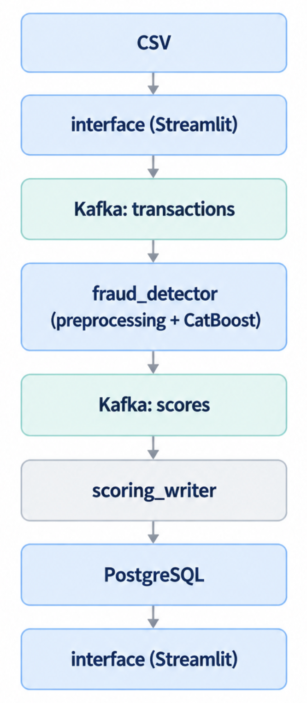

# Сервис для realtime-скоринга банковских транзакций на мошенничество

Проект построен на Kafka и состоит из нескольких независимых сервисов:

- Streamlit-интерфейс загружает CSV-файл и отправляет транзакции в Kafka.
- `fraud_detector` читает транзакции из Kafka, выполняет preprocessing и inference CatBoost-модели.
- Результаты скоринга публикуются в отдельный Kafka topic.
- `scoring_writer` читает результаты и сохраняет их в PostgreSQL.
- Streamlit позволяет посмотреть последние fraud-транзакции и распределение score.
- Kafka UI используется для просмотра Kafka topics, сообщений и consumer groups.

## Архитектура



<sub>`interface` — один Streamlit-сервис, который отправляет транзакции в Kafka и отображает результаты из PostgreSQL.</sub>

## Kafka topics

- `transactions` — входные транзакции.
- `scores` — результаты скоринга: `transaction_id`, `score`, `fraud_flag`.

`fraud_flag = 1`, если `score >= 0.5`.

## Запуск

```bash
docker compose build
docker compose up -d
```
Проверить состояние сервисов:
```bash
docker compose ps -a
```

## Интерфейсы
Streamlit:

http://localhost:8501

Kafka UI:

http://localhost:8080

## Результаты

В Streamlit доступны:

- последние 10 транзакций с fraud_flag = 1;
- гистограмма score для последних 100 транзакций.

Результаты сохраняются в PostgreSQL.

## Остановка
```bash
docker compose down
```